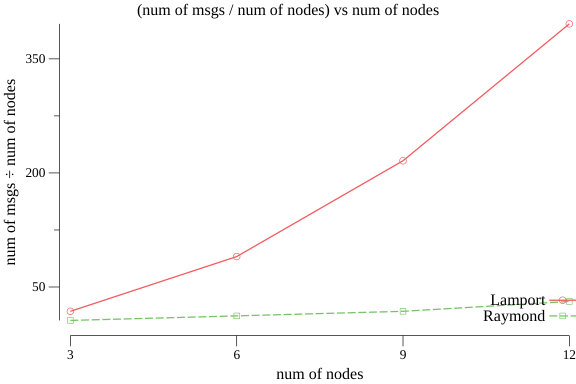
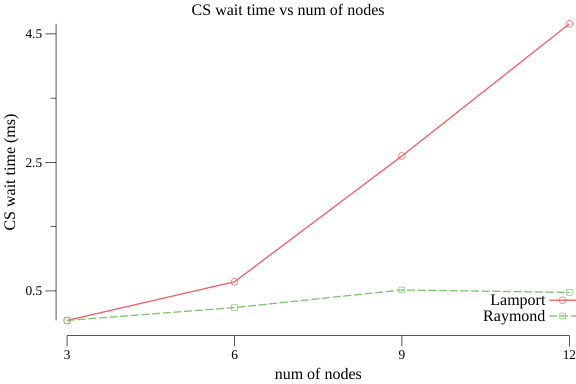
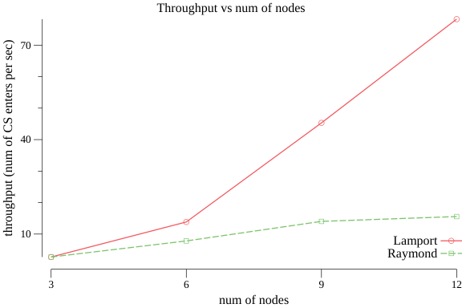

## Raymond and Lamport

### Lamport Algorithm Implementation

package `lamport` contains lamport's algorithm implementation.

reference: "Time, Clocks, and the Ordering of Events in a Distributed System" by Leslie Lamport

### Raymond Algoirthm Implementation

package `raymond` contains raymond's algorithm implementation

reference: "A Tree-Based Algorithm for Distributed Mutual Exclusion" by Kerry Raymond

### Testing

`report/main.go` contains interface `Algorithm` which is implemented by both lamport and raymond algorithm code.
Both implementations must implement interface `Algorithm`.

```go
type Algorithm interface {
	ID() int
	ProcessMessage(b []byte)
	InCS() bool
	EnterCS()
	ExitCS()
	AskToEnterCS()
	WaitForCS()
}
```

Testing is done using multiple num of nodes (3,6,9,12) with 12 iterations. Message complexity, Response time, System throughput graphs can be generated by running

```
go run report/main.go
```

Report generation will take 2-3 minutes.

| Algo    | Nodes | Message Complexity | Response Time | Throughput      |
| ------- | ----- | ------------------ | ------------- | --------------- |
| Lamport | 3     | 216                | 5.499019ms    | 1m8.729933082s  |
| Lamport | 6     | 1080               | 1.241806964s  | 2m32.343616329s |
| Lamport | 9     | 2592               | 7.491720551s  | 4m56.241365024s |
| Lamport | 12    | 4752               | 24.450843328s | 9m28.986381758s |
| Raymond | 3     | 96                 | 599.272088ms  | 1m15.871362844s |
| Raymond | 6     | 190                | 3.005459531s  | 2m53.466908752s |
| Raymond | 9     | 306                | 7.461316254s  | 4m55.477617174s |
| Raymond | 12    | 390                | 12.014946558s | 6m58.880047825s |

**Graphs are drawn using following formulas:**
message complexity = sum of num of messages / num of nodes
response time = sum of CS waiting time / num of nodes
throughput = sum of num of CS completed in 1 milli second / num of nodes

\*CS = critical section

#### Message Complexity



#### Response Time (CS waiting time)



#### System Throughput (num of CS enters per unit of time)



`go run *.go --id 0 --neighbour 1 --neighbour 2 --algorithm raymond`
`go run *.go --id 1 --neighbour 0 --algorithm raymond`
`go run *.go --id 2 --neighbour 0 --algorithm raymond`
`go run *.go --id 3 --neighbour 0 --algorithm raymond`

`go run *.go --id 0 --neighbour 1 --neighbour 2 --holder 0 --tokens 2 --algorithm raymond-K-entry`
`go run *.go --id 1 --neighbour 0 --holder 0 --tokens 2 --algorithm raymond-K-entry`
`go run *.go --id 2 --neighbour 0 --holder 0 --tokens 2 --algorithm raymond-K-entry`
`go run *.go --id 3 --neighbour 0 --holder 0 --tokens 2 --algorithm raymond-K-entry`

`go run report/main.go --id 0 --num-of-nodes 4`
`go run report/main.go --id 1 --num-of-nodes 4`
`go run report/main.go --id 2 --num-of-nodes 4`
`go run report/main.go --id 3 --num-of-nodes 4`

## References

- https://github.com/rohitmalaga/Raymonds-Tree-based-distributed-mutual-exclusion-algorithm
- https://github.com/topics/lamport-algorithm
- https://github.com/smicn/Car2Car
- https://github.com/Leogaogithub/Mutual-Exclusion-in-Distributed-Systems
- https://github.com/DylanNS/LamportLogicalClock
- https://github.com/jonhealy1/csc464_assign2
- https://github.com/brndmfrd/BridgeSim
- https://github.com/swairshah/LamportMutex
- https://stackoverflow.com/questions/3419341/how-to-calculate-turning-direction/56278133#56278133
- https://github.com/joyoyoyoyoyo/lamport-logical-clocks-in-a-distributed-system
- https://en.wikipedia.org/wiki/Lamport%27s_distributed_mutual_exclusion_algorithm
- https://www.ics.uci.edu/~cs237/reading/files/A%20Tree-Based%20algorithm%20for%20Distributed%20Mutual%20exclusion.pdf
- file:///Users/reddy.prasad/Downloads/Multi-Token20Distributed20Mutual20Exclusion20Algorithm.pdf
- https://www.computer.org/csdl/pds/api/csdl/proceedings/download-article/12OmNBqdrdh/pdf
