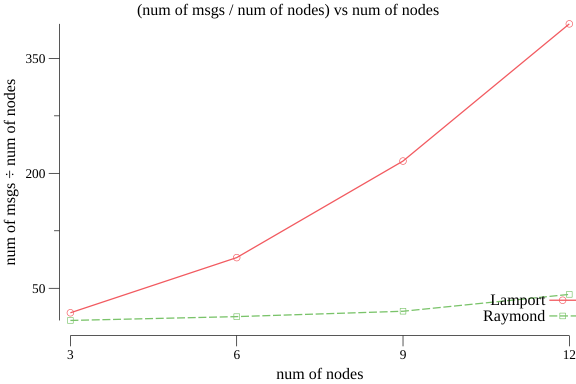

## Distributed Lock Simulation (Cars crossing narrow bridge)

### Lamport Algorithm Implementation

package `lamport` contains lamport's algorithm implementation.

reference: "Time, Clocks, and the Ordering of Events in a Distributed System" by Leslie Lamport

### Raymond Algorithm Implementation

package `raymond` contains raymond's algorithm implementation

reference: "A Tree-Based Algorithm for Distributed Mutual Exclusion" by Kerry Raymond

### Lamport K entry Algorithm Implementation

package `lamport-K-entry` contains "Lamport K entry" implementation. This modified version of lamports to allow mulitiple entries to critical section. `CSID` is unique identifier for a critical section. when multiple nodes tries enter CS with same `CSID` they all get approval enter. In our car crossing simulation, when one is on bridge and another requests to enter bridge in same direction, second will get approval to enter.

### Raymond K entry Algorithm Implementation

package `raymond-K-entry` contains "Raymond K entry" implementation. This modified version of raymonds to allow mulitiple entries to critical section. Unfortunately, I couldn't able to finish this.

This algorithm designed such a way to prevent starvation. Ex: if car waiting for entering bridge, it won't acknowledge (defers reply) car coming from other direction. That's why sometimes, you only see one car passing the bridge in same direction. If no, car is waiting for entering bridge, then multiple cars can cross bridge in same direction

ref: https://www.computer.org/csdl/pds/api/csdl/proceedings/download-article/12OmNBqdrdh/pdf

### Narrow Bridge Simulation

In all cases, cars starts at random position and moves with random speed.

Below commands can be run in single machine as seperate process. Or can be run in multiple machines.
All commands I mentioned are to run in single machine. To run in multiple machines, change `--neighbour` value with respective IP and port values. `--neighbour` format is `<node-id>:<host>:<port>`

#### Run GUI first

Run

```
go run gui/main.go --listen :7500
```

#### One car at a time

This can be simulated using `raymond` and `lamport` implementations I did.

##### Using Raymond

```
go run *.go --id 0 --listen :7000 --gui :7500 --neighbour 1:127.0.0.1:7001 --neighbour 2:127.0.0.1:7002 --neighbour 3:127.0.0.1:7003 --holder 0 --algorithm raymond
go run *.go --id 1 --listen :7001 --gui :7500 --neighbour 0:127.0.0.1:7000 --holder 0 --algorithm raymond
go run *.go --id 2 --listen :7002 --gui :7500 --neighbour 0:127.0.0.1:7000 --holder 0 --algorithm raymond
go run *.go --id 3 --listen :7003 --gui :7500 --neighbour 0:127.0.0.1:7000 --holder 0 --algorithm raymond
```

##### Using Lamport

```
go run *.go --id 0 --listen :7000 --gui :7500 --neighbour 1:127.0.0.1:7001 --neighbour 2:127.0.0.1:7002 --neighbour 3:127.0.0.1:7003 --algorithm lamport
go run *.go --id 1 --listen :7001 --gui :7500 --neighbour 0:127.0.0.1:7000 --neighbour 2:127.0.0.1:7002 --neighbour 3:127.0.0.1:7003 --algorithm lamport
go run *.go --id 2 --listen :7002 --gui :7500 --neighbour 0:127.0.0.1:7000 --neighbour 1:127.0.0.1:7001 --neighbour 3:127.0.0.1:7003 --algorithm lamport
go run *.go --id 3 --listen :7003 --gui :7500 --neighbour 0:127.0.0.1:7000 --neighbour 1:127.0.0.1:7001 --neighbour 2:127.0.0.1:7002 --algorithm lamport
```

#### Multiple cars in same direction

##### Using Lamport K entry

```
go run *.go --id 0 --listen :7000 --gui :7500 --neighbour 1:127.0.0.1:7001 --neighbour 2:127.0.0.1:7002 --neighbour 3:127.0.0.1:7003 --algorithm lamport-K-entry
go run *.go --id 1 --listen :7001 --gui :7500 --neighbour 0:127.0.0.1:7000 --neighbour 2:127.0.0.1:7002 --neighbour 3:127.0.0.1:7003 --algorithm lamport-K-entry
go run *.go --id 2 --listen :7002 --gui :7500 --neighbour 0:127.0.0.1:7000 --neighbour 1:127.0.0.1:7001 --neighbour 3:127.0.0.1:7003 --algorithm lamport-K-entry
go run *.go --id 3 --listen :7003 --gui :7500 --neighbour 0:127.0.0.1:7000 --neighbour 1:127.0.0.1:7001 --neighbour 2:127.0.0.1:7002 --algorithm lamport-K-entry
```

##### Using Raymond K entry

I was not able to finish this within time. But I added `raymond-K-entry` just for reference

##### How I generated travelling path ?

Run

```
python3 -m http.server --directory . 8000
```

visit http://localhost:8000 in browser. you see a canvas with background image (`gui/resources/bg.png`). Draw on that image from pos X to pos Y. Once you done drawing a file will get download automatically which contains coords of drawn path. files `paths/bridge.txt`, `paths/leftsidecircle.txt`, `paths/rightsidecircle.txt` are generated like this

### Testing

`report/main.go` contains interface `Algorithm` which is implemented by both lamport and raymond algorithm code.
Both implementations must implement interface `Algorithm`.

```go
type Algorithm interface {
	ID() int
	ProcessMessage(b []byte)
	InCS() bool
	EnterCS()
	ExitCS()
	AskToEnterCS()
	WaitForCS()
}
```

Testing is done using multiple num of nodes (3,6,9,12) with 12 iterations. Message complexity, Response time, System throughput graphs can be generated by running

```
go run report/main.go
```

Report generation will take 2-3 minutes.

| Algo    | Nodes | Messages (avg) | CS waiting time (median) (sec) | Time taken to complete CS (median) (sec) |
| ------- | ----- | -------------- | ------------------------------ | ---------------------------------------- |
| Lamport | 3     | 18             | 0.04                           | 2.71                                     |
| Lamport | 6     | 90             | 0.64                           | 13.84                                    |
| Lamport | 9     | 216            | 2.60                           | 45.31                                    |
| Lamport | 12    | 395            | 4.66                           | 78.25                                    |
| Raymond | 3     | 8              | 0.04                           | 2.71                                     |
| Raymond | 6     | 13             | 0.24                           | 7.81                                     |
| Raymond | 9     | 20             | 0.51                           | 14.03                                    |
| Raymond | 12    | 42             | 0.48                           | 15.56                                    |

### Screenshot


**Graphs are drawn using following formulas:**

message complexity = sum of num of messages

response time = sum of CS waiting time

throughput = sum of num of CS completed in 1 second

\*CS = critical section

#### Message Complexity



#### Response Time (CS waiting time)


#### System Throughput (num of CS enters per unit of time)


## References

- https://stackoverflow.com/questions/3419341/how-to-calculate-turning-direction/56278133#56278133
- https://github.com/joyoyoyoyoyo/lamport-logical-clocks-in-a-distributed-system
- https://en.wikipedia.org/wiki/Lamport%27s_distributed_mutual_exclusion_algorithm
- https://www.ics.uci.edu/~cs237/reading/files/A%20Tree-Based%20algorithm%20for%20Distributed%20Mutual%20exclusion.pdf
- https://www.computer.org/csdl/pds/api/csdl/proceedings/download-article/12OmNBqdrdh/pdf
